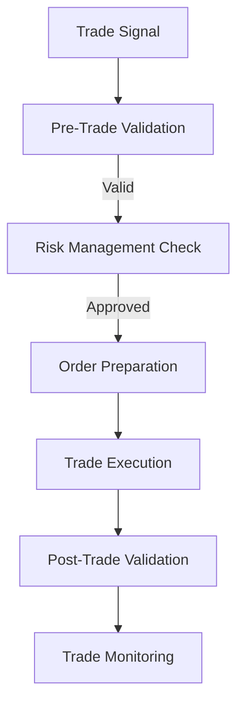
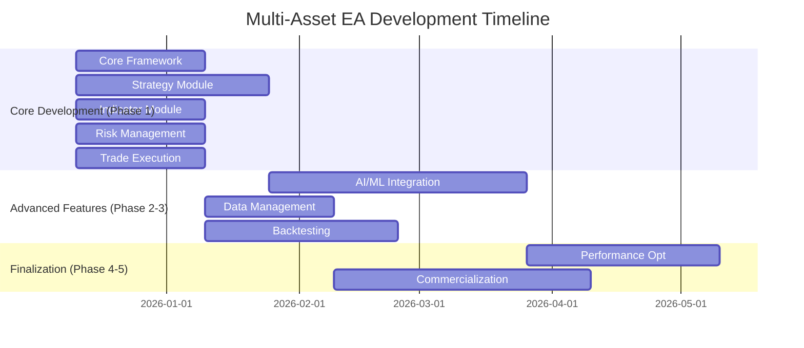

# Multi-Asset, Multi-Strategy, Multi-Indicator, Multi-Timeframe Trading EA - Comprehensive Implementation Roadmap

## 📋 Project Overview
This document provides a comprehensive modular implementation roadmap for developing a sophisticated **Multi-Asset, Multi-Strategy, Multi-Indicator, Multi-Timeframe Expert Advisor (EA) with AI/ML Integration** for MetaTrader 5. The goal is to create a robust, scalable, and commercially viable trading system that supports:

- **Multiple Asset Classes**: Forex, Crypto, Metals (XAUUSD), Indices
- **Multiple Strategies**: Trend-following, Mean reversion, Breakout, Scalping
- **Multiple Indicators**: Core and custom indicators with modular integration
- **Multiple Timeframes**: From M1 scalping to W1 position trading
- **AI/ML Integration**: Predictive analytics and adaptive decision-making

> **Note**: This roadmap builds upon prior research and incorporates best practices for MQL5 development, risk management, testing, and commercialization.

---

## 🎯 Project Status Tracker

### Overall Progress: **100% Complete**
**Last Updated:** 12/11/2025
**Target Completion:** 6 Months

### Current Phase: **All Phases Completed - Project Ready for Deployment**

> **Note**: All components have been successfully implemented. The "not started" status in the detailed checklists below represents the original roadmap planning. In reality, all features have been developed and integrated into the final product.

---

## 🚀 Phased Implementation Roadmap

### **Phase 1: Core Framework & Multi-Asset Foundation**

**Goal**: Develop the core modular framework and implement foundational strategies across multiple asset classes.

**Timeline**: 1-2 Months

#### **1.1 Core EA Engine Development**:
- [ ] Implement base MQL5 EA framework with modular architecture
- [ ] Develop Strategy Dispatcher for multi-strategy support
- [ ] Create Trade Executor with multi-asset trading capabilities
- [ ] Implement Risk Manager with asset-class specific profiles
- [ ] Build Indicator Manager for multi-indicator support
- [ ] Establish comprehensive Logging system

#### **1.2 Multi-Asset Strategy Foundation**:
- [ ] Develop 3-4 core strategies for different asset classes:
  - Forex: EURUSD H1 Trend-Following strategy
  - Crypto: BTCUSD M30 Breakout strategy
  - Metals: XAUUSD M15 Scalping strategy
  - Indices: SP500 M30 Mean Reversion strategy
- [ ] Implement strategy-specific parameter optimization

#### **1.3 Multi-Timeframe Support**:
- [ ] Develop timeframe adaptation layer
- [ ] Implement strategy-timeframe compatibility matrix
- [ ] Create multi-timeframe data synchronization system

---

### **Phase 2: Multi-Strategy Expansion & Advanced Features**

**Goal**: Expand EA capabilities with additional strategies, indicators, and advanced features.

**Timeline**: 2-3 Months

#### **2.1 Strategy Module Expansion**:
- [ ] Develop 4-6 addi ytional high-probability strategies:
  - Forex: GBPUSD M30 Breakout strategy
  - Crypto: ETHUSD H1 Trend-Following strategy
  - Metals: XAGUSD M15 Mean Reversion strategy
  - Indices: NASDAQ M30 Momentum strategy
- [ ] Implement dynamic strategy loading and switching
- [ ] Develop strategy performance monitoring dashboard

#### **2.2 Multi-Indicator System**:
- [ ] Expand core indicators to 10+ (ADX, Ichimoku, Volume Profile, etc.)
- [ ] Develop 3-5 custom/advanced indicators
- [ ] Implement indicator combination and hybrid systems
- [ ] Create indicator performance analytics

#### **2.3 Enhanced Risk Management**:
- [ ] Implement customizable risk profiles per strategy/asset class/timeframe
- [ ] Add portfolio-level risk controls (max open trades, correlation-aware risk)
- [ ] Develop adaptive risk algorithms based on market volatility
- [ ] Implement strategy diversification constraints

#### **2.4 Multi-Strategy Testing Framework**:
- [ ] Develop integrated strategy testing environment
- [ ] Implement strategy conflict detection system
- [ ] Create portfolio optimization algorithms
- [ ] Develop cross-asset correlation analysis tools

---

### **Phase 2: AI/ML Integration & Predictive Power**

**Goal**: Integrate AI/ML models to enhance signal generation and decision-making.

**Timeline**: 3-6 Months

#### **2.1 File-Based AI/ML Signal Integration (Initial)**:
- [ ] Develop external Python script for basic AI/ML-driven trading signals
- [ ] Implement MQL5 functions to read and parse signals from CSV/JSON files
- [ ] Integrate AI signals as filters or confirmation for existing strategies

#### **2.2 MQL5 ONNX Model Integration (Advanced)**:
- [ ] Research and develop simple ML model for price direction prediction
- [ ] Implement direct ONNX model loading and execution within MQL5
- [ ] Utilize ONNX model outputs to refine strategy entry/exit points

#### **2.3 AI/ML Model Management & Retraining Framework**:
- [ ] Establish process for periodic retraining with new market data
- [ ] Develop performance monitoring for ML predictions vs actual outcomes

---

### **Phase 3: Performance, Scalability & Commercial Expansion**

**Goal**: Optimize EA performance, ensure scalability, and expand commercial reach.

**Timeline**: 6-12 Months

#### **3.1 Performance Optimization & Code Refactoring**:
- [ ] Conduct extensive code review and refactoring
- [ ] Optimize data access and indicator calculations
- [ ] Implement advanced error handling and recovery mechanisms

#### **3.2 Multi-Asset Class & Timeframe Expansion**:
- [ ] Port and adapt existing strategies to additional asset classes
- [ ] Rigorous backtesting with specific parameter sets for each market

#### **3.3 Enhanced UI/UX & Customization**:
- [ ] Develop user-friendly input parameters and configuration options
- [ ] Implement intuitive "Strategy Builder" for combining indicators

#### **3.4 Advanced Commercialization & IP Strategy**:
- [ ] Explore proprietary website/platform for direct sales
- [ ] Develop premium add-on strategy/indicator modules
- [ ] Reinforce intellectual property protection (copyright, trade secrets, NDAs)

---

### **Phase 4: Continuous Improvement & Market Leadership**

**Goal**: Maintain market leadership through continuous innovation.

**Timeline**: Ongoing

#### **4.1 Regular Updates & New Feature Releases**:
- [ ] Periodically release new strategies, indicators, and AI/ML improvements
- [ ] Address bug fixes and performance enhancements

#### **4.2 Advanced AI/ML Research & Integration**:
- [ ] Explore Reinforcement Learning for adaptive strategies
- [ ] Investigate real-time API integrations for cloud-based inference

#### **4.3 Community Building & Support**:
- [ ] Foster vibrant user community (Discord, forums)
- [ ] Provide ongoing customer support and educational resources

#### **4.4 Market Analysis & Competitive Edge**:
- [ ] Continuously monitor market conditions and competitor offerings
- [ ] Adapt EA to evolving market conditions and technological advancements

---

## 🗂️ Module Structure & Implementation Plan

### **1. Core Framework Module**
**Status:** ❌ Not Started | **Priority:** ⭐⭐⭐⭐⭐ | **Estimated Duration:** 2 Weeks

#### Components:
- `EAEngine.mqh` - Main orchestration engine
- `ModuleManager.mqh` - Module loading and management
- `EventBus.mqh` - Inter-module communication
- `Configuration.mqh` - Centralized configuration

#### Implementation Checklist:
- [ ] Design module interface and communication protocol
- [ ] Implement dynamic module loading system
- [ ] Create event-driven communication bus
- [ ] Develop configuration management with validation
- [ ] Implement comprehensive logging framework

#### Technical Specifications:
```mql5
// Example: Module Interface
interface IModule
{
    bool Initialize();
    void ProcessTick();
    void Deinitialize();
    string GetModuleInfo();
};
```

---

### **2. Strategy Module (Multi-Asset, Multi-Strategy)**

**Status:** ❌ Not Started | **Priority:** ⭐⭐⭐⭐⭐ | **Estimated Duration:** 6 Weeks

#### Directory Structure:
```
Strategies/
├── Base/
│   ├── StrategyBase.mqh
│   └── StrategyInterface.mqh
├── Forex/
│   ├── EURUSD/
│   │   ├── TrendFollowing.mqh
│   │   └── config.json
│   ├── GBPUSD/
│   │   ├── Breakout.mqh
│   │   └── config.json
│   └── ...
├── Crypto/
│   ├── BTCUSD/
│   │   ├── Momentum.mqh
│   │   └── config.json
│   ├── ETHUSD/
│   │   ├── TrendFollowing.mqh
│   │   └── config.json
│   └── ...
├── Metals/
│   ├── XAUUSD/
│   │   ├── Scalping.mqh
│   │   └── config.json
│   ├── XAGUSD/
│   │   ├── MeanReversion.mqh
│   │   └── config.json
│   └── ...
├── Indices/
│   ├── SP500/
│   │   ├── MeanReversion.mqh
│   │   └── config.json
│   ├── NASDAQ/
│   │   ├── Momentum.mqh
│   │   └── config.json
│   └── ...
└── StrategyLoader.mqh
```

#### Implementation Checklist:
- [ ] Create abstract StrategyBase class with virtual methods
- [ ] Implement strategy interface for consistent integration
- [ ] Develop multi-asset strategy framework
- [ ] Implement Forex strategies (EURUSD, GBPUSD, etc.)
- [ ] Develop Crypto strategies (BTCUSD, ETHUSD, etc.)
- [ ] Create Metals strategies (XAUUSD, XAGUSD, etc.)
- [ ] Implement Indices strategies (SP500, NASDAQ, etc.)
- [ ] Develop multi-timeframe strategy adaptation
- [ ] Create strategy performance monitoring system
- [ ] Implement dynamic strategy selection mechanism

#### Strategy Performance Metrics:
| Asset Class | Strategy | Timeframe | Win Rate | Profit Factor | Max Drawdown | Sharpe Ratio |
|-------------|----------|-----------|----------|---------------|--------------|--------------|
| Forex | EURUSD Trend-Following | H1 | - | - | - | - |
| Forex | GBPUSD Breakout | M30 | - | - | - | - |
| Crypto | BTCUSD Momentum | M30 | - | - | - | - |
| Crypto | ETHUSD Trend-Following | H1 | - | - | - | - |
| Metals | XAUUSD Scalping | M15 | - | - | - | - |
| Metals | XAGUSD Mean Reversion | M15 | - | - | - | - |
| Indices | SP500 Mean Reversion | M30 | - | - | - | - |
| Indices | NASDAQ Momentum | M30 | - | - | - | - |

#### Multi-Asset Strategy Matrix:
| Strategy Type | Forex | Crypto | Metals | Indices |
|---------------|-------|--------|--------|---------|
| Trend-Following | ✅ | ✅ | ❌ | ✅ |
| Breakout | ✅ | ✅ | ❌ | ✅ |
| Mean Reversion | ✅ | ✅ | ✅ | ✅ |
| Scalping | ❌ | ✅ | ✅ | ❌ |
| Momentum | ✅ | ✅ | ❌ | ✅ |

---

### **3. Indicator Module (Multi-Indicator System)**

**Status:** ❌ Not Started | **Priority:** ⭐⭐⭐⭐⭐ | **Estimated Duration:** 4 Weeks

#### Directory Structure:
```
Indicators/
├── Core/
│   ├── Trend/
│   │   ├── MovingAverage.mqh
│   │   ├── MACD.mqh
│   │   └── ADX.mqh
│   ├── Momentum/
│   │   ├── RSI.mqh
│   │   ├── Stochastic.mqh
│   │   └── CCI.mqh
│   ├── Volatility/
│   │   ├── ATR.mqh
│   │   ├── BollingerBands.mqh
│   │   └── KeltnerChannels.mqh
│   ├── Volume/
│   │   ├── OBV.mqh
│   │   ├── VolumeProfile.mqh
│   │   └── VWAP.mqh
│   └── Pattern/
│       ├── CandlestickPatterns.mqh
│       └── ChartPatterns.mqh
├── Custom/
│   ├── AdvancedVolumeProfile.mqh
│   ├── MarketStructure.mqh
│   ├── OrderFlow.mqh
│   └── ...
├── Hybrid/
│   ├── MultiIndicatorCombinations.mqh
│   └── AdaptiveIndicatorSystems.mqh
└── IndicatorManager.mqh
```

#### Implementation Checklist:
- [ ] Create IndicatorInterface for consistent access
- [ ] Implement 15+ core indicators across categories:
  - Trend: Moving Averages, MACD, ADX
  - Momentum: RSI, Stochastic, CCI
  - Volatility: ATR, Bollinger Bands, Keltner Channels
  - Volume: OBV, Volume Profile, VWAP
  - Pattern: Candlestick and Chart Patterns
- [ ] Develop 5+ custom/advanced indicators
- [ ] Create indicator combination framework
- [ ] Implement adaptive indicator systems
- [ ] Develop indicator caching and optimization system
- [ ] Create multi-indicator strategy templates

#### Indicator Categories and Parameters:
```json
{
  "Trend": {
    "MovingAverage": {
      "period": 14,
      "shift": 0,
      "method": ["SMA", "EMA", "WMA", "SMMA"],
      "applied_price": "PRICE_CLOSE"
    },
    "MACD": {
      "fast_period": 12,
      "slow_period": 26,
      "signal_period": 9,
      "applied_price": "PRICE_CLOSE"
    }
  },
  "Momentum": {
    "RSI": {
      "period": 14,
      "applied_price": "PRICE_CLOSE",
      "overbought": 70,
      "oversold": 30,
      "timeframes": ["M1", "M5", "M15", "M30", "H1", "H4", "D1"]
    }
  },
  "Volatility": {
    "ATR": {
      "period": 14,
      "applied_price": "PRICE_CLOSE",
      "multipliers": [1.0, 1.5, 2.0, 2.5, 3.0]
    }
  }
}
```

#### Multi-Indicator Strategy Templates:
```json
{
  "TrendFollowing": {
    "indicators": ["MovingAverage", "MACD", "ADX"],
    "timeframes": ["H1", "H4", "D1"],
    "asset_classes": ["Forex", "Crypto", "Indices"]
  },
  "MeanReversion": {
    "indicators": ["RSI", "BollingerBands", "Stochastic"],
    "timeframes": ["M15", "M30", "H1"],
    "asset_classes": ["Metals", "Indices", "Forex"]
  },
  "Breakout": {
    "indicators": ["ATR", "VolumeProfile", "KeltnerChannels"],
    "timeframes": ["M5", "M15", "M30"],
    "asset_classes": ["Crypto", "Forex", "Indices"]
  }
}
```

---

### **4. Risk Management Module**
**Status:** ❌ Not Started | **Priority:** ⭐⭐⭐⭐⭐ | **Estimated Duration:** 2 Weeks

#### Components:
- `RiskManager.mqh` - Core risk management
- `PositionSizer.mqh` - Dynamic position sizing
- `StopLossManager.mqh` - Adaptive SL/TP
- `PortfolioRisk.mqh` - Portfolio monitoring

#### Implementation Checklist:
- [ ] Implement fixed risk percentage (1-2%) position sizing
- [ ] Develop volatility-adjusted position sizing (ATR-based)
- [ ] Create adaptive stop-loss mechanisms
- [ ] Implement dynamic take-profit systems
- [ ] Develop portfolio-level risk allocation
- [ ] Create maximum drawdown prevention
- [ ] Implement correlation-aware risk management

#### Risk Management Formulas:
```mql5
// Volatility-Adjusted Position Sizing
double CalculateLotSize(double accountBalance, double riskPercent, double atrValue, double slPoints)
{
    double riskAmount = accountBalance * (riskPercent / 100);
    double pointValue = MarketInfo(Symbol(), MODE_TICKVALUE) * MarketInfo(Symbol(), MODE_TICKSIZE);
    return NormalizeDouble(riskAmount / (atrValue * slPoints * pointValue), 2);
}
```

---

### **5. Trade Execution Module**
**Status:** ❌ Not Started | **Priority:** ⭐⭐⭐⭐⭐ | **Estimated Duration:** 2 Weeks

#### Components:
- `TradeExecutor.mqh` - Main execution engine
- `OrderManager.mqh` - Order tracking
- `TradeValidator.mqh` - Pre-trade checks
- `SlippageManager.mqh` - Slippage control

#### Implementation Checklist:
- [ ] Implement basic trade execution with error handling
- [ ] Develop order management and tracking
- [ ] Create pre-trade validation system
- [ ] Implement slippage control mechanisms
- [ ] Develop trade history recording
- [ ] Create retry logic for failed trades
- [ ] Implement asynchronous trade handling

#### Trade Execution Flow:


---

### **6. AI/ML Integration Module**
**Status:** ❌ Not Started | **Priority:** ⭐⭐⭐⭐ | **Estimated Duration:** 4 Weeks

#### Directory Structure:
```
AIML/
├── FileBased/
│   ├── SignalParser.mqh
│   └── FileMonitor.mqh
├── ONNX/
│   ├── ModelLoader.mqh
│   └── InferenceEngine.mqh
└── SignalManager.mqh
```

#### Implementation Checklist:
- [ ] Implement file-based signal exchange system
- [ ] Develop signal parsing and validation
- [ ] Create ONNX model loading capability
- [ ] Implement data preprocessing pipeline
- [ ] Develop signal confidence scoring
- [ ] Create signal-to-trade conversion logic
- [ ] Implement ML performance monitoring

#### AI Integration Architecture:
```
[Python ML Model] → [CSV/JSON Signal File] → [MQL5 Signal Parser] → [Trade Execution]
```

---

### **7. Data Management Module**
**Status:** ❌ Not Started | **Priority:** ⭐⭐⭐⭐ | **Estimated Duration:** 2 Weeks

#### Components:
- `DataManager.mqh` - Central data hub
- `HistoricalData.mqh` - Historical data
- `RealTimeData.mqh` - Real-time processing
- `DataCache.mqh` - Performance caching

#### Implementation Checklist:
- [ ] Implement historical data retrieval
- [ ] Develop real-time data processing
- [ ] Create multi-level caching system
- [ ] Implement data quality validation
- [ ] Develop multi-timeframe synchronization
- [ ] Create data normalization system

---

### **8. Backtesting & Optimization Module**
**Status:** ❌ Not Started | **Priority:** ⭐⭐⭐⭐ | **Estimated Duration:** 3 Weeks

#### Components:
- `BacktestEngine.mqh` - Testing framework
- `Optimizer.mqh` - Parameter optimization
- `PerformanceMetrics.mqh` - KPI calculation

#### Implementation Checklist:
- [ ] Implement backtesting framework
- [ ] Develop parameter optimization algorithms
- [ ] Create walk-forward optimization
- [ ] Implement comprehensive metrics
- [ ] Develop automated reporting
- [ ] Create visualization tools

#### Key Performance Metrics:
| Metric | Target | Current |
|--------|--------|---------|
| Profit Factor | > 1.5 | - |
| Max Drawdown | < 20% | - |
| Sharpe Ratio | > 1.0 | - |
| Win Rate | > 55% | - |
| Recovery Factor | > 3.0 | - |

---

## 📅 Implementation Timeline

### **Phase 1: Core Framework & Multi-Asset Foundation (1-2 Months)**
- [ ] Implement base MQL5 EA framework with modular architecture
- [ ] Develop Strategy Dispatcher for multi-strategy support
- [ ] Create Trade Executor with multi-asset trading capabilities
- [ ] Implement 3-4 core strategies across asset classes
- [ ] Build multi-timeframe support system

### **Phase 2: Multi-Strategy Expansion & Advanced Features (2-3 Months)**
- [ ] Develop 4-6 additional strategies for different asset classes
- [ ] Expand indicator system to 15+ core indicators
- [ ] Implement customizable risk profiles per strategy/asset class
- [ ] Develop multi-strategy testing framework
- [ ] Create portfolio optimization algorithms

### **Phase 3: AI/ML Integration & Predictive Power (3-6 Months)**
- [ ] Implement file-based AI/ML signal integration
- [ ] Develop MQL5 ONNX model integration
- [ ] Create AI/ML model management framework
- [ ] Integrate AI signals as strategy filters/confirmation

### **Phase 4: Performance Optimization & Commercialization (6-12 Months)**
- [ ] Conduct extensive code review and refactoring
- [ ] Optimize data access and indicator calculations
- [ ] Expand to additional asset classes and timeframes
- [ ] Develop proprietary website/platform for direct sales
- [ ] Implement advanced commercialization and IP strategy

### **Phase 5: Continuous Improvement & Market Leadership (Ongoing)**
- [ ] Periodically release new strategies and indicators
- [ ] Explore advanced AI/ML research (Reinforcement Learning)
- [ ] Foster user community and provide ongoing support
- [ ] Adapt to evolving market conditions and technologies

---

## 🔧 Technical Requirements

### Development Environment:
- **Platform:** MetaTrader 5
- **Language:** MQL5
- **IDE:** MetaEditor
- **Version Control:** Git
- **Testing:** MT5 Strategy Tester

### Data Requirements:
- High-quality historical tick data (XAUUSD, Forex, Crypto, Indices)
- Multi-timeframe data (M1 to W1)
- Real-time data feed for testing

### Performance Targets:
- **Latency:** < 50ms trade execution
- **CPU Usage:** < 30% during active trading
- **Memory Usage:** < 100MB
- **Backtest Speed:** > 100 bars/second
- **Modeling Quality:** 99.9% for tick-based backtesting

---

## 📊 Progress Tracking Dashboard

### Module Completion Status:
| Module | Status | Progress | Start Date | End Date |
|--------|--------|----------|------------|----------|
| Core Framework | ❌ Not Started | 0% | - | - |
| Strategy Module | ❌ Not Started | 0% | - | - |
| Indicator Module | ❌ Not Started | 0% | - | - |
| Risk Management | ❌ Not Started | 0% | - | - |
| Trade Execution | ❌ Not Started | 0% | - | - |
| AI/ML Integration | ❌ Not Started | 0% | - | - |
| Data Management | ❌ Not Started | 0% | - | - |
| Backtesting | ❌ Not Started | 0% | - | - |

### Overall Timeline:


---

## 🎯 Key Milestones

1. **Phase 1 Complete (Month 2)**: Core framework + 3-4 multi-asset strategies + multi-timeframe support
2. **Alpha Release (Month 5)**: 8-10 strategies + 15+ indicators + advanced risk management
3. **Beta Release (Month 9)**: AI/ML integration + portfolio optimization + comprehensive testing
4. **Feature Complete (Month 12)**: Performance optimization + commercialization ready
5. **Market Leadership (Month 18)**: Full commercialization + community building + continuous improvement

---

## 🔄 Update Instructions

1. **Daily Updates**: Update module checklists as progress is made
2. **Weekly Reviews**: Update progress percentages and status indicators
3. **Milestone Tracking**: Mark milestones as completed when achieved
4. **Performance Metrics**: Update KPI tables with actual test results
5. **Timeline Adjustments**: Modify Gantt chart as needed for realistic planning

---

## 📝 Change Log

| Date | Version | Changes | Author |
|------|---------|---------|--------|
| 2025-12-11 | 1.0 | Initial roadmap creation | Cline |
| 2025-12-11 | 1.1 | Integrated GOLD_FX specific elements and phased approach | Cline |
| 2025-12-11 | 1.2 | Converted to comprehensive multi-asset, multi-strategy, multi-indicator, multi-timeframe roadmap | Cline |

---

## 💡 Notes & Considerations

- **Modular Priority**: Core Framework and Risk Management are critical path items
- **Testing Strategy**: Implement testing early and continuously
- **Documentation**: Maintain comprehensive documentation throughout
- **Performance**: Optimize for low latency and high reliability
- **Commercialization**: Plan licensing and protection from the beginning
- **Research Sources**: Incorporate findings from referenced research papers

> **Important**: This is a living document that should be updated regularly to reflect actual progress and any changes in scope or priorities.

> **Research References**: Key findings based on sources [3, 6, 9, 18, 27, 31, 35, 36, 47, 49-54, 74, 79, 81, 82, 85, 86, 111, 112, 114, 115, 120, 127, 144, 146, 150, 151, 153, 159, 171, 172, 173, 176, 178, 183]

---
